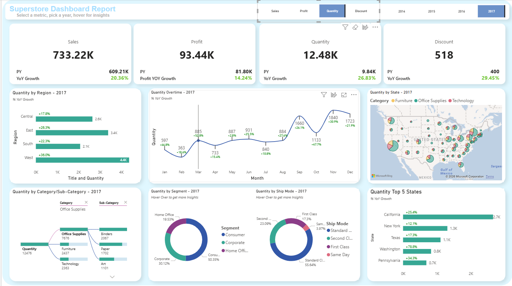

# Superstore Business Intelligence Dashboard

**Tool:** Microsoft Power BI  
**Dataset:** Superstore (Public Dataset)

---

## Dashboard Overview

/dashboard Scrrenshots/Quantity.png
## 1. Project Objective

The objective of this project is to design a scalable and interactive **Business Intelligence dashboard** using the Superstore dataset, enabling stakeholders to analyze **sales performance, profitability, order volume, and discount behavior** across multiple business dimensions.

The dashboard is built with a strong focus on:

- Dynamic metric selection
- Time-intelligence driven comparisons
- Context-aware calculations
- Variable-based DAX measures
- Fully dynamic visual titles

---

## 2. Dataset Description

The Superstore dataset is a widely used public retail dataset containing order-level transactional data.

### Key Characteristics
- Transaction-level granularity
- Multi-year historical data
- Coverage across geography, products, customers, and logistics

### Key Fields
- Order Date, Ship Date  
- Sales, Profit, Quantity, Discount  
- Category, Sub-Category  
- Segment, Ship Mode  
- Region, State, City  

---

## 3. Data Modeling Approach

A **star schema** data model was implemented to ensure optimal performance and clean filter propagation.

### Model Structure

- **Fact Table**
  - FactSales (Sales, Profit, Quantity, Discount)

- **Dimension Tables**
  - DimDate  
  - DimProducts  
  - DimCustomers  
  - DimLocation  
  - DimOrders  

### Design Principles Applied

- Single-direction (1:*) relationships
- Dedicated Date table for time intelligence
- Measures stored in a separate Measure Table
- Business logic implemented using measures instead of calculated columns

---

## 4. Measure Design and DAX Strategy

### 4.1 Variable-Based DAX Measures

All complex calculations are written using **DAX variables (`VAR`)** to:

- Improve readability
- Avoid repeated calculations
- Enhance performance
- Simplify debugging and maintenance

Standard pattern followed:
- Capture selected context values
- Compute intermediate results
- Return final metric based on logic

---

### 4.2 Dynamic KPI Selection Using Field Parameters

A **KPI Selector parameter table** enables dynamic switching between:

- Sales  
- Profit  
- Quantity  
- Discount  

The selected KPI dynamically controls:

- KPI cards
- Charts and visuals
- YoY calculations
- Tooltip values
- Visual titles

This avoids duplication of visuals and allows a single layout to support multiple metrics.

---

## 5. Time Intelligence and YoY Calculations

### Previous Year (PY) Measures

For each KPI, a Previous Year measure is defined using the Date dimension.

### Year-over-Year (YoY) Growth Logic

- YoY growth is calculated dynamically for the selected KPI
- Fully context-aware across year, region, category, and state
- Automatically adapts to slicer and filter changes
- Handles blank and zero previous-year values safely

---

## 6. Dynamic Visual Titles Using DAX

All visual titles in the dashboard are **fully dynamic** and driven by DAX.

### Purpose

- Titles automatically reflect the selected KPI
- Titles update based on year selection
- Eliminates static text and manual updates

### Example Title Behavior

- "Sales by Region – 2017"
- "Profit YoY Growth by State – 2016"
- "Monthly Quantity Trend – Selected Year"

Titles are generated using:
- SELECTEDVALUE()
- Field parameters
- DAX variables to construct readable text strings

---

## 7. Dashboard Components and Analysis

### 7.1 KPI Summary Section

Displays:
- Current Year KPI value
- Previous Year value
- YoY Growth percentage

All values update dynamically based on KPI and year selection.

---

### 7.2 Regional Performance Analysis

Bar chart comparing performance across regions:

- Central
- East
- South
- West

Insights include:
- Regional contribution
- Growth comparison
- Performance imbalance

---

### 7.3 Monthly Trend Analysis

Line chart displaying month-wise trends for the selected KPI.

Enables analysis of:
- Seasonality
- Growth and decline phases
- Month-over-month volatility

YoY growth indicators provide additional context.

---

### 7.4 Geographic Analysis (State-Level)

Map visual showing state-level performance:

- Bubble size represents KPI magnitude
- Category-wise color segmentation

Helps identify:
- High-performing states
- Regional concentration
- Category dominance by geography

---

### 7.5 Product Category and Sub-Category Analysis

Hierarchical visual displaying:

- Category contribution
- Sub-category performance

Used to identify:
- Revenue drivers
- Underperforming products
- Portfolio concentration

---

### 7.6 Customer Segment and Ship Mode Analysis

Donut charts analyze:

- Customer Segments (Consumer, Corporate, Home Office)
- Shipping Modes (Standard, First Class, Second Class, Same Day)

Supports customer and operational strategy decisions.

---

### 7.7 Top 5 States Analysis

Ranked bar chart showing:

- Top 5 states by KPI value
- YoY growth comparison

Enables focused regional performance tracking.

---

## 8. Interactivity and User Experience

The dashboard includes:

- KPI selector buttons
- Year slicers
- Hover-based tooltips
- Cross-filtering across visuals

All interactions are controlled using DAX-driven logic.

---

## 9. Performance Optimization

Key optimization techniques used:

- Extensive use of DAX variables
- Minimal calculated columns
- Reusable measures across visuals
- Optimized filter context handling

These choices ensure scalability and responsiveness.

---

## 10. Business Questions Addressed

- How is the business performing year-over-year?
- Which regions and states drive growth?
- Which products and segments contribute most?
- How do trends vary month by month?
- What is the impact of discounts on performance?

---

## 11. Tools and Technologies

- Microsoft Power BI Desktop
- Power Query (ETL)
- DAX (Measures, Variables, Time Intelligence)
- Star Schema Data Modeling

---

## 12. Conclusion

This project demonstrates advanced Power BI capabilities including:

- Variable-based DAX programming
- Dynamic KPI selection
- Time intelligence
- Context-aware calculations
- Dynamic, DAX-driven visual titles

The final dashboard is **scalable, maintainable, and business-ready**, suitable for executive reporting and analytical decision-making.
